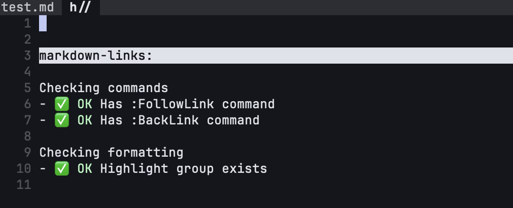

# linked-markdown.nvim
A neovim plugin that allows you to quickly navigate from one markdown file to another

Embed links into your markdown files and use them to quickly navigate around.
Supports both moving forward to the link your cursor is on or returning back to
the previous file you were linked to.

[](https://github.com/donovanhubbard/markdown-links.nvim/raw/refs/heads/main/assets/example.mov)

https://github.com/donovanhubbard/markdown-links.nvim/raw/refs/heads/main/assets/example.mov

# Installation

Lazy
```lua
return {
  "donovanhubbard/markdown-links.nvim",
  name = "markdown-links.nvim",
  ft = "markdown", -- only load for markdown files
  keys = { -- plugin does not map any keys by default
    vim.keymap.set("n", "<CR>", ":FollowLink<CR>", {silent=true}),
    vim.keymap.set("n", "<BS>", ":BackLink<CR>", {silent=true}),
  }
}
```

You can run a health check of the plugin if you used Lazy and if
the plugin is loaded (you must have a markdown file open).

Run
```
:checkhealth markdown-links
```


# Usage

Links are designated by being placed in double braces. It supports file addresses relative to the
file you currently have open.

For instance this link would take you to the file `./markdown.md`
```
This link will take you to [[markdown.md]]
```

This also works for sub directories.

```
This will take you down a sub directory [[sub/markdown.md]]
```

In order to activate a link, move your cursor on top of the link and invoke the command
```
:FollowLink
```

I recommend mapping this function to a useful key. I use the enter key.

To go back to the previous file that you jumped from, use the command
```
:BackLink
```

I recommend mapping this to a useful key as well. I use the backspace key.

The `BackLink` command will remember all previous links that you've jumped from so you can
keep calling `:BackLink` until you've returned to your original page. Keep in mind you can jump
to other files that are not markdown files so you may not have the plugin loaded anymore.

# Development

This uses MiniTest for running tests. A handy reference is located here: 
https://nvim-mini.org/mini.nvim/TESTING#executing-lua-code

MiniTest recommends to download it's codebase and place it in the `deps/` folder which I have done.
This is listed as a git sub module so you will need to check that out as well.

```
git clone git@github.com:donovanhubbard/markdown-links.nvim.git
cd markdown-links.nvim/
git submodule update --init --recursive
```

Then run your tests using the makefile. From the root of the git directory run:
```
make test
```

It's important that this is run from the root of the directory as the relative links in the 
tests won't work if you run them from anywhere else.

# Acknowledgements

This plugin is based largely on the vimwiki plugin, although that plugin adds far more features
than I needed. https://github.com/vimwiki/vimwiki


